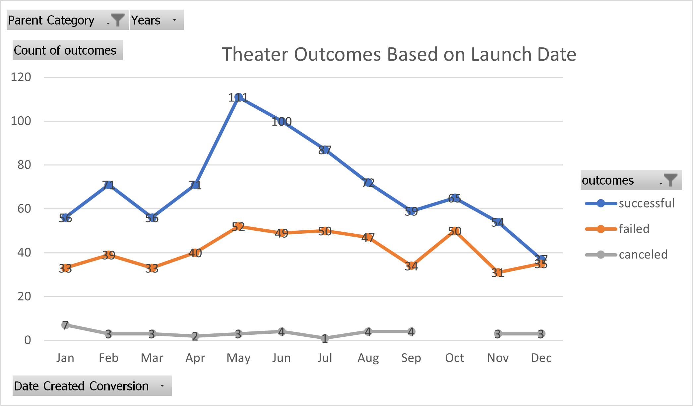
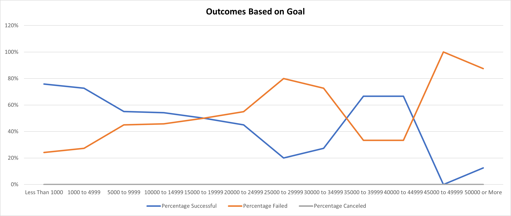

# Kickstarting with Excel

## Overview of Project

**Lousie** an upcoming playwright wants to fund her play **FEVER** by using crowdfunding campaign. She estmates a budget of $10000 and is primarily focussed in US and Great Britain market campaign funding for plays based on the launch date. As a data analyst by using powerfull tool *Excel* a deep dive of crowd funding data analysis and visualization is provided to Lousie to determine the specific parameters that would help her in raising fund to her startup drama production.

### Purpose

Based on the statistical data distribution and outcomes visualized in respect to launch date and cateogory of the campaigns organized Louise’s play *Fever* came close to its fundraising goal in a short span of time. She now wants to understand how different campaigns fared in relation to their launch dates and their funding goals
This can be determined by visualizing data pertaining to campaign outcomes based on their launch dates and their funding goals

## Analysis and Challenges

By implementing the analysis techniques provided by Excel following inferences are derived on the Outcomes based on
    Launch Date
    Goals of Funding

### Analysis of Outcomes Based on Launch Date

To determine the outcomes based on the Launch date the number of successful, failed and canceled outcomes are visualized by grouping based months of the year. The following graph is plotted by using Pivot table to determine total number of successful, failed and canceled outcomes based on Launch date and filtering the group funding data with Parent Category as *Theatre* and years of campaign launch.

The below graph visualizes the total number of successful, failed and canceled outcomes plotted against the each month. 
-From the below graph it is clearly interpreted that maximum number of successful kickstarter outcomes are seen in *June and May months*. 
-There is consistent increase in the success rate from March to June months.

### Analysis of Outcomes Based on Goals

To determine the outcomes based on the Goals we need to analyze the percentage of successful, failed and canceled outcomes by grouping the data based the set of Goal amount with each set having range of dollar amount.

To dertermine Percentage of successful and failure campaigns data from Total number of projects which includes successful, failure and canceled campaigns for specific range of goal amount

The below graph visualizes percentage of succesful, failure and canceled outcomes plotted in reference to the range of goal amount.
-It is interpreted that there is maximun success percentage when the *goal amount is less than $5000*
-A steep decline in the success rate and Total number of campaign projects is noted when the goal amount exceeds 5000$

### Challenges and Difficulties Encountered

1. The major challenge encoutered was to write down the Readme file. As the format and approach is not quite familier it took time in drafting the file.
2. It would be helpful if there is a session on creating Readme to practically understand the documentation link given in the Challenge
3. Drawing conclusion might be little difficult when the statistical data distribution comes into picture

## Results

- What are two conclusions you can draw about the Outcomes based on Launch Date?
    1. The maximum number of successful kickstarter outcomes are seen in June and May months with total of 211 successful outcomes. 
    2. During Fall and Winter months i.e. from September to Feb there are less number of campaign projects launched with less success rate except for the October and    Febraury months giving good success rates.
    3. Based on the data outcomes, It can be concluded that if Lousie can conduct campaigns in May and June month there is high probability of getting her play funded.

- What can you conclude about the Outcomes based on Goals?
   1. It can be concluded that there is maximun success percentage when the goal amount is less than $5000 with total of 529 successful campaign outcomes with 388 projects in range of $1000 to $5000
   2. Lousie should concentrate on this budget range below $5000

- What are some limitations of this dataset?
    1. It is also being noted that when the Goal amount is between $35000 to $45000 although the total number of projects launched is quite minimal with just 9 in number there is good success rate in years 2014 to 2015.
    2. This data needs further analysis to determine the other factors which impacting launching fewer campaigns despite of good success rate. The dataset impacting number of campaigns launched each year might help in understanding.

- What are some other possible tables and/or graphs that we could create?
    1. Graphs to determine the outcomes of theatre/plays with respect to country
    2. Statiscal Data distribution of Goal amounts other categories and subcategories to compare and interpret the analysis in more effective way.
    
The kickstarter challenge data analysis is completely captured in the sheet [Kickstarter_Challenge](https://github.com/Ghousiya9891/kickstarter-analysis/blob/main/Kickstarter_Challenge.xlsx/)
